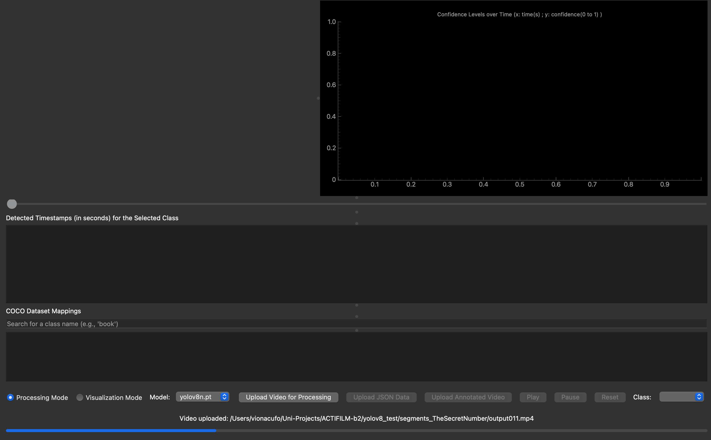
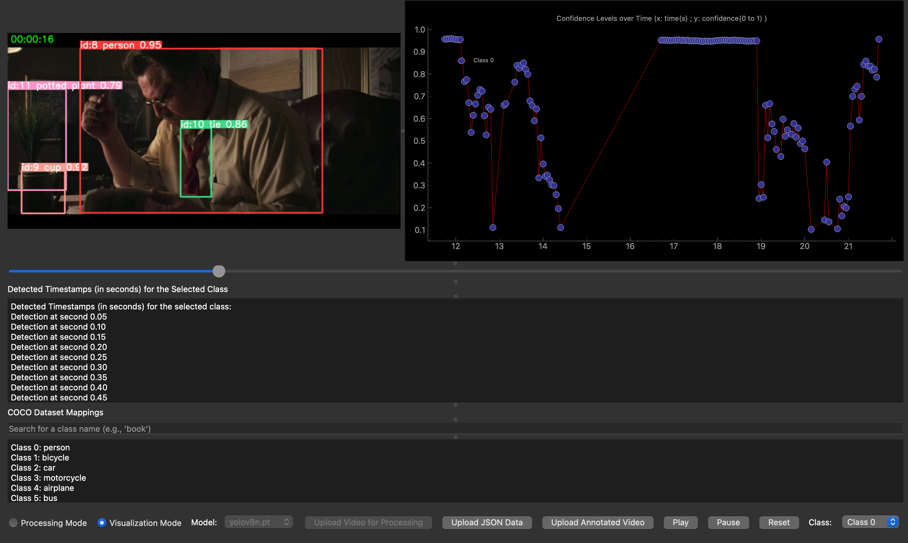
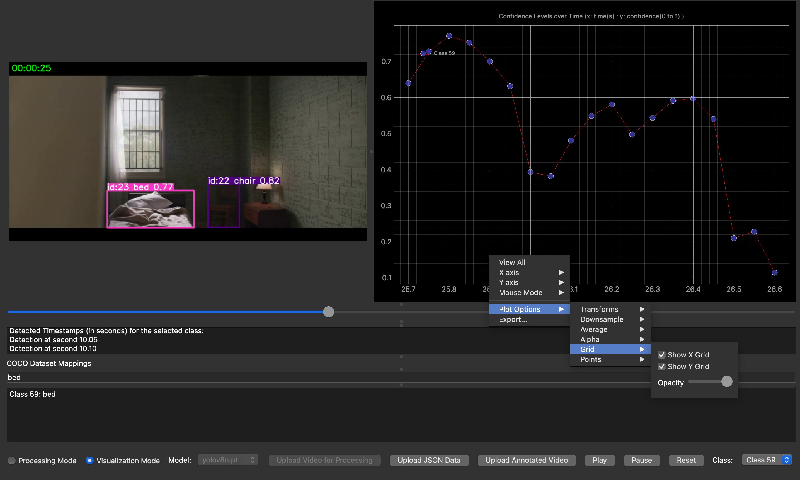

# User Manual for ActiFilm Application

## Table of Contents
1. [Introduction](#introduction)
2. [Installation](#installation)
3. [Usage](#usage)
   - [Processing Mode](#processing-mode)
   - [Visualization Mode](#visualization-mode)
4. [Limitations](#limitations)
5. [Running the Additional Script on Google Colab](#running-the-additional-script-on-google-colab)
6. [Support](#support)

## Introduction

ActiFilm is a tool designed to assist researchers in the automated analysis of video fragments from movies. It was originally developed as part of a broader research project by Professors [Patrik Vuilleumier](https://www.unige.ch/cisa/center/members/vuilleumier-patrik/)
 and [Timothée Proix](https://neurocenter-unige.ch/research-groups/timothee-proix/), both researchers at the Geneva University Neurocenter and supervisors of our project.

Their work for this particular experiment focused on identifying specific brain regions associated with distinct emotional responses in subjects undergoing fMRI (functional magnetic resonance imaging) scans while watching film fragments in order to track their brain activity. To synchronize fMRI data with the visual stimuli from these fragments, it is essential to accurately label the visual information they contain, a task traditionally performed manually by people.

ActiFilm addresses this challenge by integrating state-of-the-art object detection models to extract multiple characteristics from video fragments and by representing the detected information as time series that can later be used for synchronization with brain imaging data.

## Installation

1. **Clone the Repository**: Clone the GitLab repository to your local machine.
    ```sh
    git clone https://gitlab.unige.ch/ndlab/actifilm.git
    cd actifilm
    ```

2. **Create a Virtual Environment**:
    ```sh
    python3 -m venv venv
    source venv/bin/activate  # On Windows, use `venv\Scripts\activate`
    ```

3. **Install Dependencies**:
    ```sh
    pip install -r requirements.txt
    ```

4. **Run the Application**:
    ```sh
    python actifilm.py
    ```

## Usage

The application has two main modes: Processing Mode and Visualization Mode.

### Processing Mode

1. **Upload Video for Processing**:
    - Click on the "Upload Video for Processing" button.
    - Select the video file you want to process.
    - Choose the object detection model from the dropdown list.
    - Click on the "Process" button to start the processing.

    

2. **Processing**:
    - The application will process the video, detect objects, and generate two files: an annotated video and a JSON file containing detection data.
    - A progress bar will indicate the status of the processing.

### Visualization Mode

1. **Upload Annotated Video and JSON Data**:
    - Click on the "Upload Annotated Video" button and select the annotated video file.
    - Click on the "Upload JSON Data" button and select the JSON file.

    

2. **Visualize Results**:
    - The annotated video will be displayed alongside a synchronized graph showing confidence levels of detected objects over time.
    - You can select different classes from the dropdown to update the graph in real time.
    - Use the slider to navigate through the video, and the graph will update accordingly.
    - Click on "Play" to play the video and see the graph update in real time.
    - Zoom and navigate inside the graph to interpret the data.
    - Right-click on the graph to save the results.
    - Press the A icon on the bottom-left corner to go back to the synchronised section of the graph.

    

## Limitations

- **Processing Time**: Video processing using object detection models can be time-consuming, especially on machines without GPUs. The application currently uses CPU processing, which may lead to longer processing times.
- **Model Accuracy**: The accuracy of object detection depends on the pre-trained models used (e.g., YOLO). The application does not guarantee the accuracy of detections.
- **ID Consistency**: While attempting to track objects across frames, inconsistencies in ID assignment by the YOLO model were observed. This feature is not fully reliable and may require further improvement.
- **Limited Model Selection**: Currently, the application supports a limited number of models from the Ultralytics library (YOLOv8n, YOLOv8s, YOLOv8m, YOLOv8l, YOLOv8x). Expanding this to support additional models or newer versions may require updating the application and ensuring compatibility with those models, considering the dataset to which these models have been trained on as well as the format of their output.

## Running the Additional Script on Google Colab

If you do not have access to a GPU, you can use the additional script provided to run the video processing on Google Colab. Here are the steps:

1. **Upload the Script to Google Colab**:
    - Open [Google Colab](https://colab.research.google.com/).
    - Upload the provided script (`ActiFilm_VideoProcessing.ipynb`) to a new notebook.

2. **Run the Script**:
    - Execute the cells in the notebook to process your video.
    - The script will use Google Colab's GPU resources to speed up the processing.
    - Once the processing is complete, download the generated annotated video and JSON file.

3. **Load Processed Files in ActiFilm**:
    - Use the Visualization Mode in the ActiFilm application to upload and analyze the processed files.

## Support

For any issues or questions, please contact us at viona.cufo@etu.unige.ch or yardel.hurtado@etu.unige.ch


